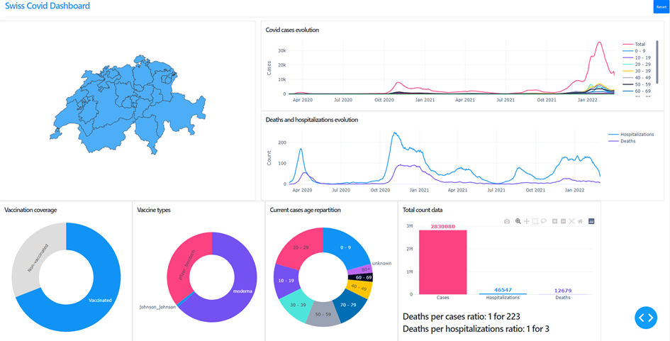
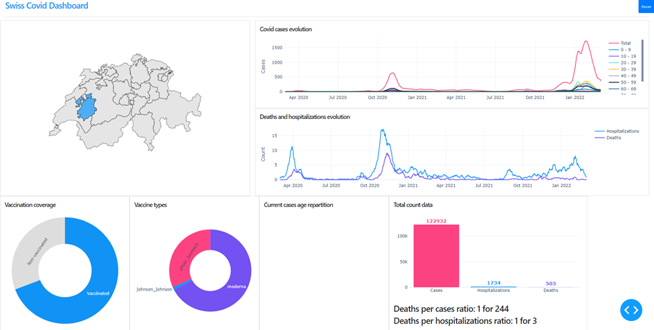

This small project is a Dash application that displays Covid-19 data in Switzerland.

### Data
The raw data comes from the [opendata.swiss plateform](https://opendata.swiss/fr/).

### Requirements 
You can install the dependencies of this project using the `requirements.txt` file:
```shell script
pip install -r requirements.txt
```

### Application execution
To launch the application, simply run the following command line:
```shell script
python swiss_covid_dashboard.py
```
And open this address in a web browser: `http://127.0.0.1:8050/`. 

### Application content
This simple dashboard allows the selection of a region (whole Switzerland or a canton)
by clicking on the interactive map, and visualize metrics associated with Covid-19:
- Number of cases/hospitalizations/deaths evolution
- Vaccination rate and vaccines used
- Statistics about age ranges of the current Covid cases
- Deaths per cases ratio, deaths per hospitalizations ratio

Here are two screenshots of the app, with two different regions selected:

#### Switzerland


#### Fribourg canton
